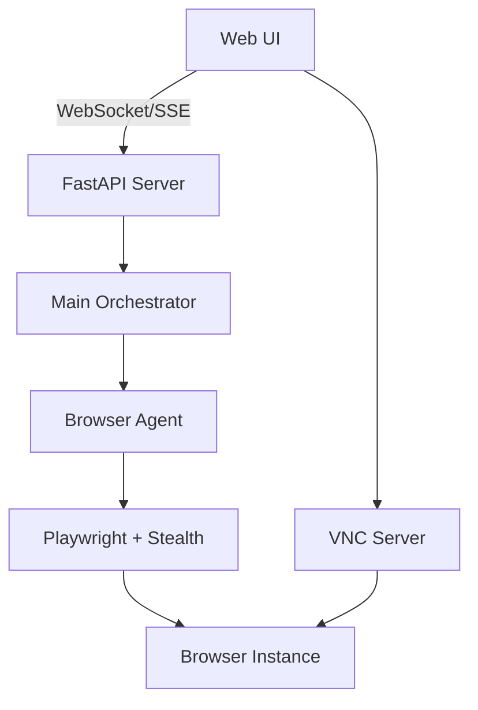

# 🤖 AgentTheo

<div align="center">

[](https://www.python.org/downloads/)
[](https://www.docker.com/)
[](https://opensource.org/licenses/MIT)
[](https://github.com/psf/black)

**The AI-powered browser automation agent that thinks and acts like a human**

[Features](#features) • [Quick Start](#quick-start) • [Documentation](#documentation) • [Contributing](#contributing)

</div>

---

## 🎯 What is AgentTheo?

AgentTheo is an autonomous AI agent that can browse the web, interact with websites, and complete complex tasks through natural language commands. Built on cutting-edge stealth technology and powered by LLMs, it operates like a human user while providing developers with powerful automation capabilities.

### 🌟 Key Features

- **🧠 Natural Language Control** - Just tell it what to do: *"Find the best deals on noise-cancelling headphones"*
- **👻 Advanced Stealth Mode** - Bypasses bot detection with human-like behavior patterns
- **🖥️ Visual Debugging** - Watch it work in real-time through integrated VNC viewer
- **🔄 Multi-Browser Support** - Works with Chromium, Firefox, and WebKit
- **🚀 Web UI Interface** - Modern chat interface with live browser view
- **🐳 Fully Containerized** - One command to run, no complex setup
- **⚡ Hot Reload Development** - Instant code updates without rebuilding

## 🚀 Quick Start

### Prerequisites

- [Docker Desktop](https://www.docker.com/products/docker-desktop/) installed and running
- [OpenRouter API key](https://openrouter.ai) for LLM access

### Installation

```bash
# Clone the repository
git clone https://github.com/yourusername/AgentTheo.git
cd AgentTheo

# Set up your API key
cp config/.env.template config/.env
# Edit config/.env and add your OPENROUTER_API_KEY

# Start AgentTheo
./run.sh start
```

### 🎮 Using AgentTheo

1. Open your browser to **http://localhost:8000**
2. Type your command in the chat interface
3. Watch AgentTheo work its magic!

#### Example Commands

```
"Search for the latest AI news and summarize the top 3 stories"
"Go to LinkedIn and find job postings for Python developers in San Francisco"
"Compare prices for MacBook Pro on Amazon, Best Buy, and Apple Store"
"Fill out the contact form on example.com with test data"
```

## 🏗️ Architecture



### Core Components

- **🎯 Orchestrator** - Intelligent task routing and agent coordination
- **🌐 Browser Agent** - Handles all web interactions with stealth capabilities
- **💬 Web UI** - Real-time streaming interface with integrated VNC
- **🛡️ Stealth System** - Advanced anti-detection and human emulation

## 🛠️ Development

### Development Modes

```bash
# Standard mode - auto-detects changes
./run.sh restart

# Dev mode - quick rebuilds
./run.sh restart -dev

# Hot reload - instant updates
./run.sh restart -hot

# Force rebuild - clean slate
./run.sh restart --rebuild
```

### Project Structure

```
AgentTheo/
├── agent/               # Core agent logic
│   ├── browser/        # Browser automation & stealth
│   ├── core/           # Orchestrator
│   └── llm/            # LLM integration
├── webui/              # Web interface
├── docker/             # Container configs
└── tests/              # Test suite
```

### Running Tests

```bash
# All tests
./run.sh test

# Stealth features
python -m pytest tests/test_stealth.py -v

# Browser automation
python -m pytest tests/test_browser_agent.py -v
```

## 🥷 Stealth Technology

AgentTheo employs cutting-edge techniques to avoid bot detection:

- **WebDriver Masking** - Hides automation indicators
- **Fingerprint Randomization** - Unique browser signatures
- **Human Behavior Emulation** - Natural mouse movements and delays
- **Canvas/WebGL Spoofing** - Prevents tracking via graphics
- **Network Pattern Mimicry** - Realistic request patterns

[Learn more about our stealth implementation →](docs/STEALTH_IMPLEMENTATION.md)

## 📚 Documentation

- [Complete Documentation](docs/)
- [API Reference](docs/API.md)
- [Architecture Guide](docs/ARCHITECTURE.md)
- [Stealth Features](docs/STEALTH_IMPLEMENTATION.md)
- [Contributing Guide](CONTRIBUTING.md)

## 🤝 Contributing

We welcome contributions! Whether it's bug fixes, new features, or documentation improvements.

### How to Contribute

1. Fork the repository
2. Create your feature branch (`git checkout -b feature/AmazingFeature`)
3. Commit your changes (`git commit -m 'Add some AmazingFeature'`)
4. Push to the branch (`git push origin feature/AmazingFeature`)
5. Open a Pull Request

See [CONTRIBUTING.md](CONTRIBUTING.md) for detailed guidelines.

## 🐛 Troubleshooting

<details>
<summary>Docker won't start</summary>

```bash
# Ensure Docker Desktop is running
# Check system requirements
# Try: docker system prune -a
```
</details>

<details>
<summary>Can't connect to Web UI</summary>

```bash
# Check if port 8000 is available
lsof -i :8000

# Restart with clean build
./run.sh restart --rebuild
```
</details>

<details>
<summary>Browser automation fails</summary>

```bash
# Check logs
docker logs agenttheo

# Verify API key
cat config/.env | grep OPENROUTER_API_KEY

# Test with simpler task
```
</details>

## 🗺️ Roadmap

- [ ] Multi-agent collaboration
- [ ] Cloud deployment options
- [ ] Browser extension interface
- [ ] Mobile browser support
- [ ] Custom action recording
- [ ] API-first architecture

## 📄 License

This project is licensed under the MIT License - see the [LICENSE](LICENSE) file for details.

## 🙏 Acknowledgments

- [Playwright](https://playwright.dev/) for browser automation
- [LangGraph](https://python.langchain.com/docs/langgraph) for agent orchestration
- [OpenRouter](https://openrouter.ai/) for LLM access
- The open-source community for inspiration and tools

---

<div align="center">

**Built with ❤️ by the AgentTheo Team**

[Report Bug](https://github.com/yourusername/AgentTheo/issues) • [Request Feature](https://github.com/yourusername/AgentTheo/issues) • [Join Discord](https://discord.gg/agenttheo)

</div>